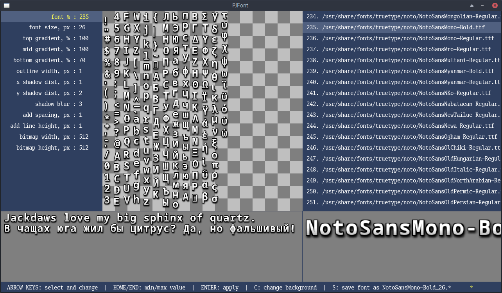

# PJFont
Simple bitmap font generator. Powered by [Ebiten](https://ebiten.org/), inspired by [Littera](http://kvazars.com/littera/).



Output format is JSON and PNG with same name.
Example:
```json
{"Name":"NotoSansMono-Bold_26","LineHeight":27,"Chars":[
{"Code":32,"X":1,"Y":1,"W":10,"H":11,"XOff":-4,"YOff":-4,"XAdv":17},
{"Code":33,"X":1,"Y":12,"W":15,"H":29,"XOff":1,"YOff":-23,"XAdv":17},
{"Code":34,"X":1,"Y":41,"W":19,"H":17,"XOff":-1,"YOff":-23,"XAdv":17},
...
```
